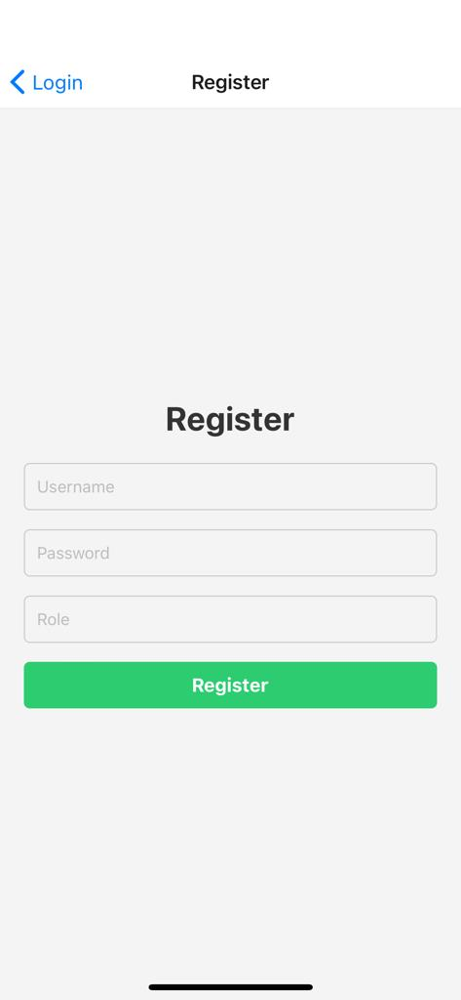
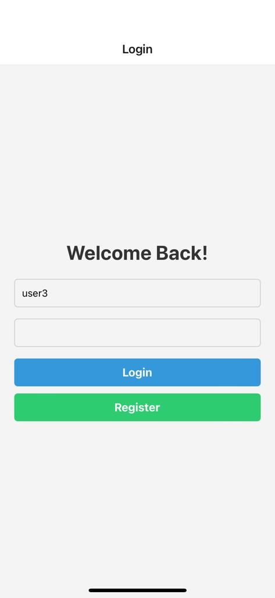
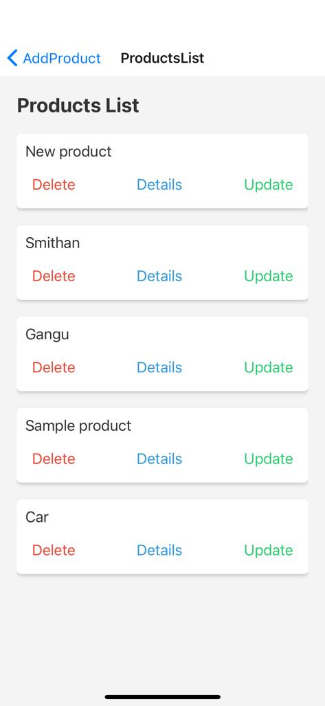
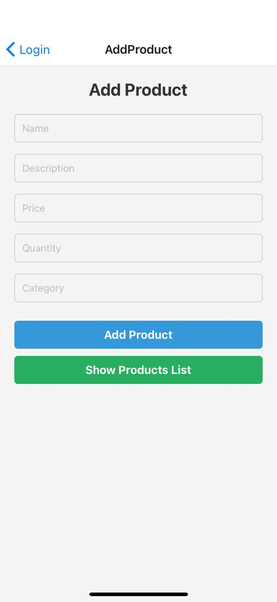
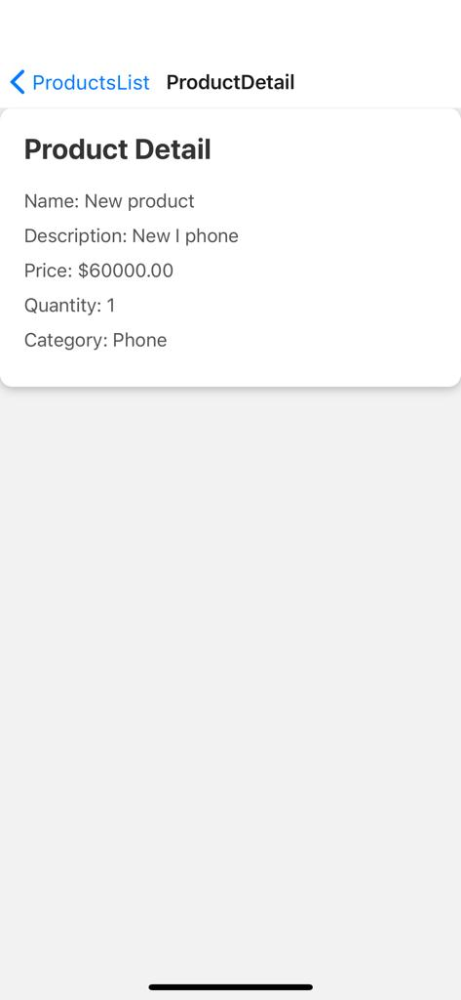

# React Native Product Management App

## Overview

This React Native application serves as a simple product management system. It provides functionality to add, view, update, and delete products.

## Installation

1. **Clone the Repository:**

    ```bash
    git clone <https://github.com/ravindrapv/Crud-frontend.git>
    ```


2. **Install Dependencies:**

    ```bash
    npm install --force
    ```

## Usage

- **Run the Application:**

    ```bash
    npx start
    ```

    or

    ```bash
    expo start
    ```

## Screenshots

Add some screenshots of your application here to visually represent how it looks.

### Login Screen and register





### Products List Screen



### Add Product Screen



### Product Detail Screen




## Screens

- **Login:** Allows users to log in to the application.
- **Register:** Allows new users to create an account.
- **Add Product:** Enables users to add new products to the list.
- **Products List:** Displays a list of all products with options to view, update, and delete each product.
- **Product Detail:** Shows detailed information about a selected product.
- **Update Product:** Allows users to update the details of a product.

## Dependencies

- **React Navigation:** Used for navigating between different screens.
- **Axios:** Handles API requests to interact with the backend.
- **React Native Elements:** Provides UI components for a consistent look.

## Project Structure

- **src/screens/Auth:** Contains login and register screens.
- **src/screens/Products:** Includes screens for adding, listing, viewing, and updating products.
**src/**API**:** Manages API communication.

